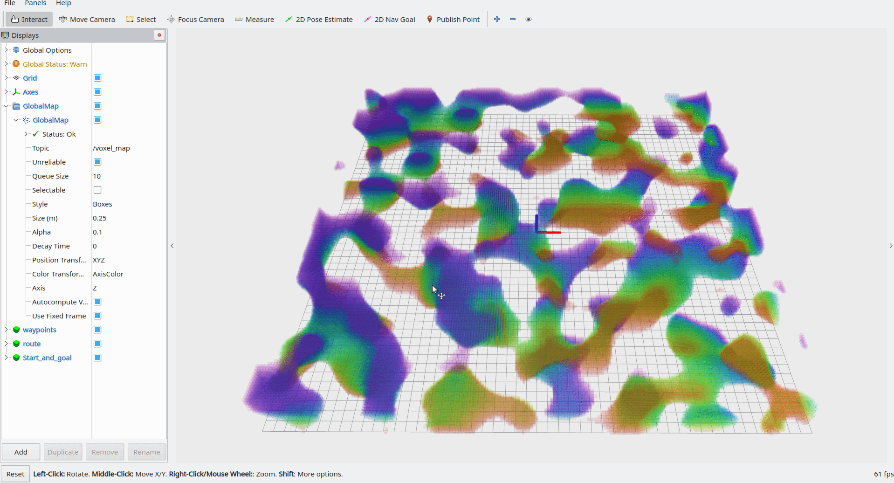

# JPS_path_planning
This repository provides a way to use the Jump Point Search **jps3d** library ([KumarRobotics/jps3d](https://github.com/KumarRobotics/jps3d)) directly on point clouds. The utilities provided in `src/jps_path_planning/include/VoxelGraph` convert `sensor_msgs/PointCloud2` messages into the appropriate voxel representation required by the **jps3d** library.


## Prerequisites
Before building the code, ensure the following packages are installed:
```
sudo apt install ros-noetic-pcl-ros ros-noetic-pcl-conversions
sudo apt install libeigen3-dev
```
## Usage
After installation, run the plan_path.sh script. If the code builds without errors, an RViz window will pop up. Provide two points (start and goal) as 2D Nav Goal inputs in RViz, and the planned path will be displayed in red.


## Credits and Acknowledgments
This project uses open-source components from the following repositories:
1. [jps3d](https://github.com/KumarRobotics/jps3d) (for JPS algorithm)
2. [mockamap](https://github.com/HKUST-Aerial-Robotics/mockamap) (for generating random map of pointclouds)
3. [GCOPTER](https://github.com/ZJU-FAST-Lab/GCOPTER) (for Path visualization)